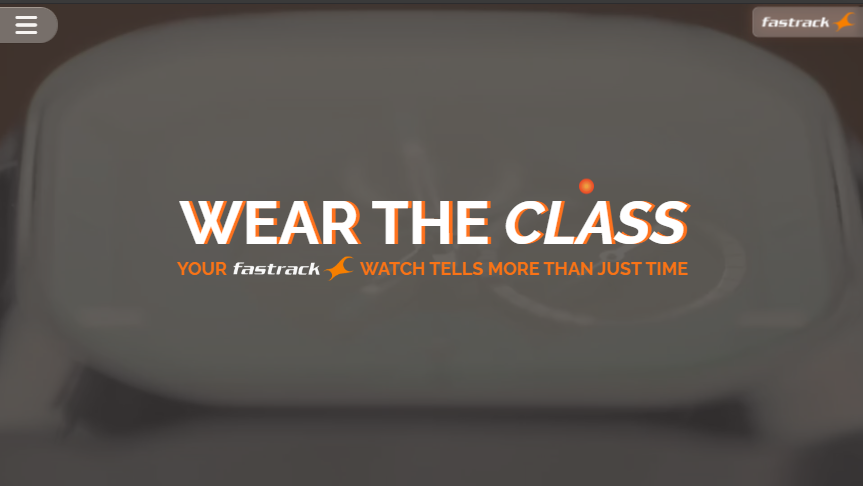
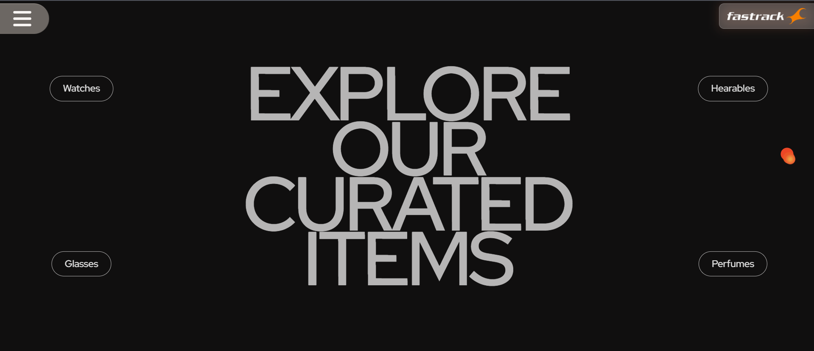
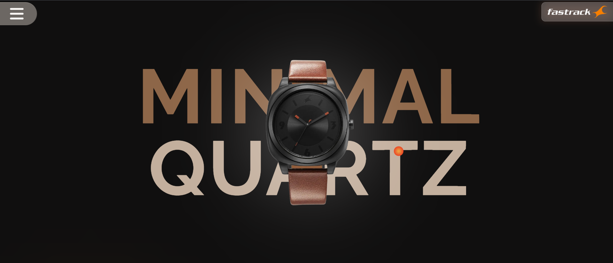
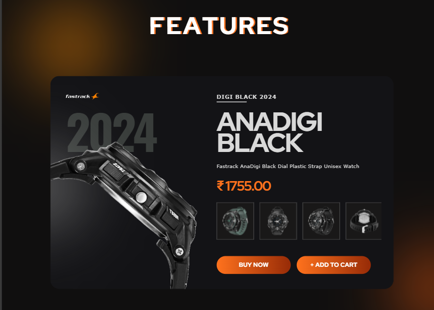
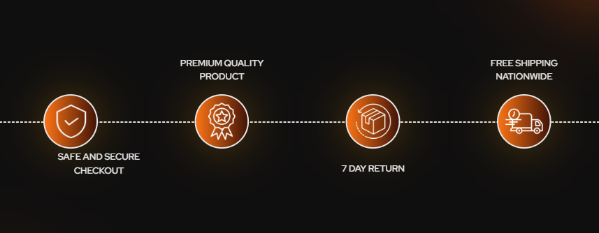
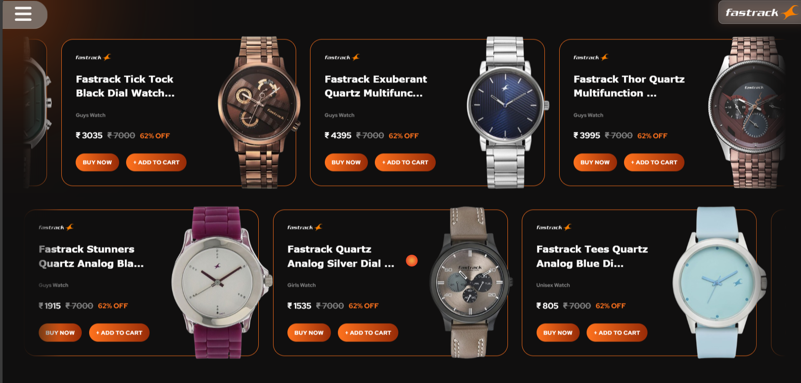
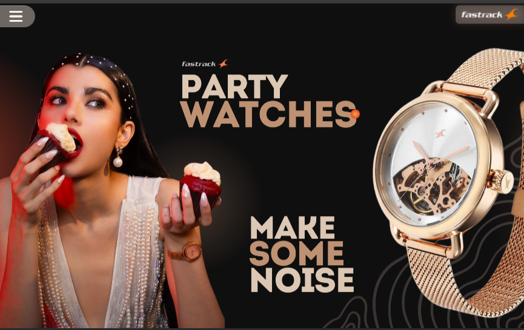
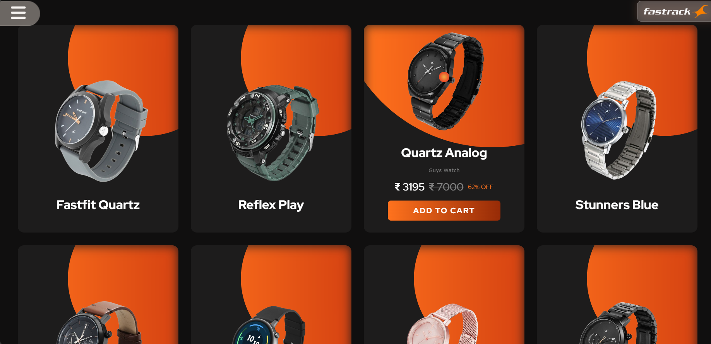
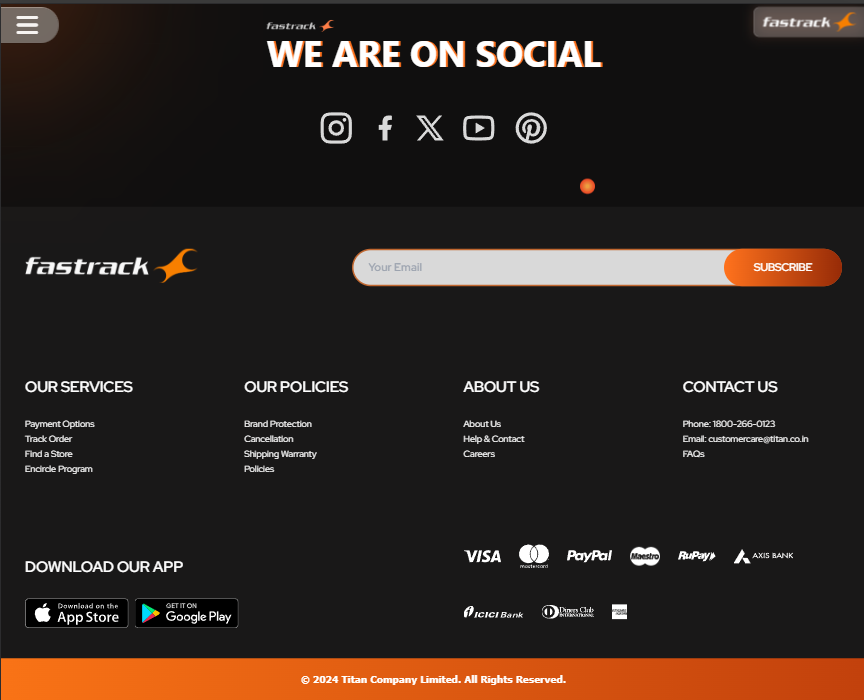

# Reimagine Project - Fastrack Website Recreation & Reimagination

Welcome to our project! This website is a reimagined and recreated version inspired by the Fastrack brand website, which primarily focuses on Watches. Our project is built using HTML, the Tailwind CSS framework, the Swiper JS library, the GSAP library & vanilla JavaScript.

We created this website for the "Re-Imagine Hackathon," a frontend web design competition hosted by Sheryians Coding School. This project was developed for round 2 of the Re-Imagine Hackathon. We are a team of 4 members working on this Project. Our team name is **Ctrl-Plus-Web**.

## Let's Talk About Our Project
<ul>
    <li style="margin-bottom: 40px;">
        <p>At first we created a loader that shows a transition from a sundial to a modern wrist watch.</p>
        
    </li>
   <li style="margin-bottom: 40px;">
        <p>Our project includes a homepage with a circular navigation menu positioned in the top left corner. The logo is aligned in the top right corner.</p>
        
    </li>
    <li style="margin-bottom: 40px;">
        <p>Next we have our animated category section where hovering on a category button shows a video of that particular category product.</p>
        
    </li>
    <li style="margin-bottom: 40px;">
        <p>Explore how we design a horizontal scroll bar to give the user a seamless scrolling experience.</p>
        
    </li>
    <li style="margin-bottom: 40px;">
        <p>Explore our feature product card. Here we use swiper js</p>
        
    </li>
    <li style="margin-bottom: 40px;">
        <p>This is our service section and it is animate on scroll.</p>
        
    </li>
    <li style="margin-bottom: 40px;">
        <p>Discover our trending section where the watch cards are moving infinite.</p>
        
    </li>
    <li style="margin-bottom: 40px;">
        <p>Explore this image slicer where you can find your vibe products.</p>
        
    </li>
    <li style="margin-bottom: 40px;">
        <p>This is our bestseller section where every card is animate on hover.</p>
        
    </li>
    <li style="margin-bottom: 40px;">
        <p>This is the why us section where we use a video scrolling animation.</p>
        
    </li>
    <li style="margin-bottom: 40px;">
        <p>At last but not the least this is our footer section.</p>
        
    </li>
</ul>


## Installation

Install with npm

```bash
npm i
```

## To Run the Project after cloning

Run server with npm

```bash
npm run dev
```

## API Reference

#### Get all items

```http
    https://jayasaha811733.github.io/ReImagine_2_API/assets.json
```

## Authors

- [@Jayashree Saha](https://github.com/JayaSaha811733)
- [@Angshu Das](https://github.com/Angshu09)
- [@Debojeet Dutta](https://github.com/BinaryDebojeet)
- [@Sumit Dutta](https://github.com/Sumit02635)

## Acknowledgements

- [JavaScript reference](https://www.w3schools.com)
- [Tailwind docs](https://tailwindcss.com/docs/installation)
- [Swiper JS demo ](https://swiperjs.com/demos)
